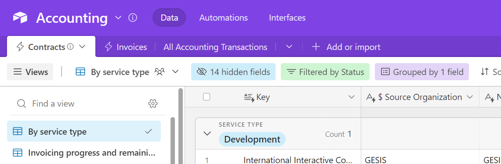

(accounts:airtable)=
# AirTable accounts

We use AirTable to track some of our leads, contracts, and invoicing data.
This page covers this account and how to access it.

## Read-only access to the AirTable

[Here's a link to our primary AirTable workspace](https://airtable.com/invite/l?inviteId=inv3bBae7WUqQsehA&inviteToken=7689178d3e79af8956d1f5cd958d9d8e63160e86b70c74d2d8bb2502ce665e00&utm_medium=email&utm_source=product_team&utm_content=transactional-alerts).

This is a read-only link, valid for any `@2i2c.org` address.
If you need edit permissions, use the [shared AirTable account](airtable:shared).

(airtable:shared)=
## Edit access to the AirTable

We have a single account on the "Pro" plan of AirTable.
It is the only account with edit permissions.

To access this account, use our [shared passwords account](account:bitwarden) for credentials.

The rest of this page describes an overview of AirTable's structure in general.

## Bases

A base is the highest unit of organization in AirTable.
They are generally categorized by a broad topic that might have a number of related datasets inside.

For example, we have [an accounting AirTable base](accounting:statements) that contains several tables with information about our incoming and outgoing funds and contracts.

Each base has three types of elements in it: **data**, **automations**, and **interfaces**.
Each is described below.

### Data

Contain tabular datasets that make up the content in a base.
These are kind of like **databases**, in the sense that they have typed columns, and each row represents a single "record" within that table.

A base usually has **many tables of data**, and these can then be interlinked with one another.

For example, we have [our Contracts table](https://airtable.com/appbjBTRIbgRiElkr/tbliwB70vYg3hlkb1/viwOWxGxMBVmJFwiC) as well as [our Invoices table](https://airtable.com/appbjBTRIbgRiElkr/tblkmferOITqS2vH8/viwNA9Z2UhSchcuvA) in the same base.
This lets us link records in `Invoices` with those in `Contracts` based on a unique ID in each.

#### Views

Views are ways to filter, group, and subset your data for visualizing purposes.
They do not change the underlying dataset, they merely provide a way to look at it a different way.
For example, our [Invoices table](https://airtable.com/appbjBTRIbgRiElkr/tblkmferOITqS2vH8) has two views:

- [**Incoming**](https://airtable.com/appbjBTRIbgRiElkr/tblkmferOITqS2vH8/viwfuamzW4kbaQSSJ) to only show invoices that are for revenue.
- [**Outgoing**](https://airtable.com/appbjBTRIbgRiElkr/tblkmferOITqS2vH8/viwNA9Z2UhSchcuvA) to only show invoices that are for costs.

#### URL structure

The URL structure of data generally looks like this:

```
https://airtable.com/< BASE ID >/< TABLE ID >/< VIEW ID >
```

### Automations

Allow us to perform certain actions on a schedule or repeated after a certain condition.

For example, we have [a Link Invoices automation](https://airtable.com/appbjBTRIbgRiElkr/wflPVmcmuMb38DYIW/wtr3oTLWhTJoVns8d) that automatically links new records of Invoices with their respective Contract every hour.

### Interfaces

Are dashboards that provide quick and visual summaries of the tables in a base.
For example, we have [a Monthly Invoices dashboard](contracts:dashboards) that summarizes major financial invoicing and contracts activity each month.

### Example screenshot

Below you can see an example of the **Accounting base**, with the three major sections for **Data**, **Automations**, and **Interfaces** at the top.

Below these, you see **multiple tables** corresponding to different kinds of data (Contracts and Invoices, for example).

For the active table, we can see **multiple views** of that table to the left, corresponding to different subsets of data.


