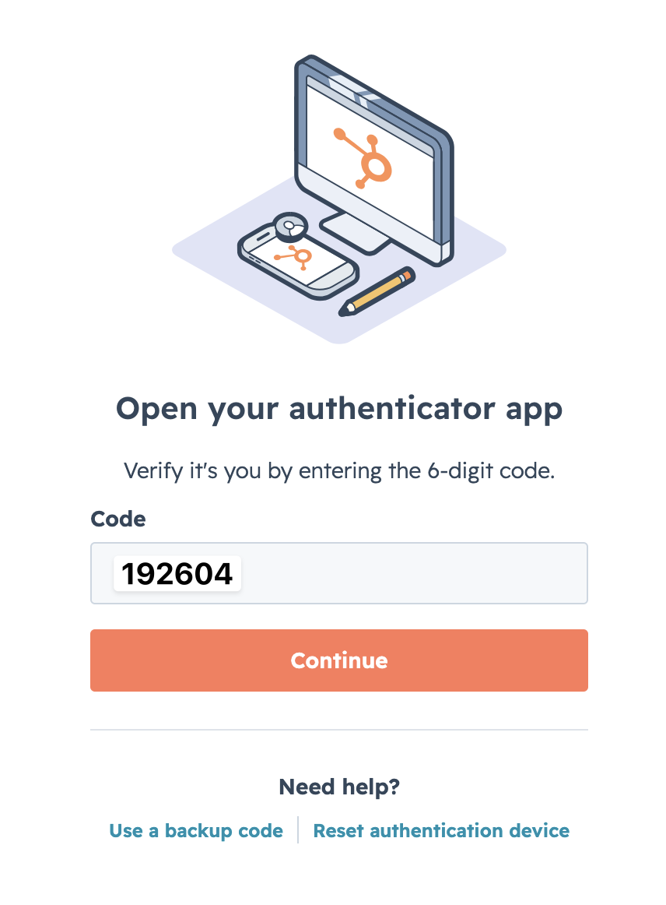
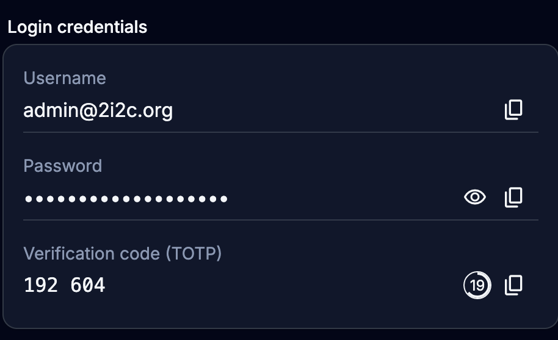

(hubspot:index)=

# Customer Relationship Management (CRM)

We use HubSpot as our Source of Truth for tracking Contacts, Organizations, Deals and the relationships that drive each of them through sales. 

See our [Guide to the HubSpot CRM](https://docs.google.com/document/d/1T6kl8bOt6S0ltt5ICxlmX-CKSgkrL3e1qmvGYDI1JNM/edit?tab=t.0#heading=h.o3k954vg6ioy).

:::{note}
We used to use AirTable for this, here's a link to [our old CRM in AirTable](https://airtable.com/appbjBTRIbgRiElkr?). We'll deprecate that in the coming months.
:::

## How to log into hubspot

- Go to the [HubSpot Account page](https://app.hubspot.com/home)
- U: `2i2c Admin`. P: `See bitwarden`.
- You'll see a 2FA prompt like this:

  
- Use the [team Bitwarden](#account:bitwarden) to find the 2FA credentials:

  
- Click `Skip for now` when prompted to improve the 2FA.
