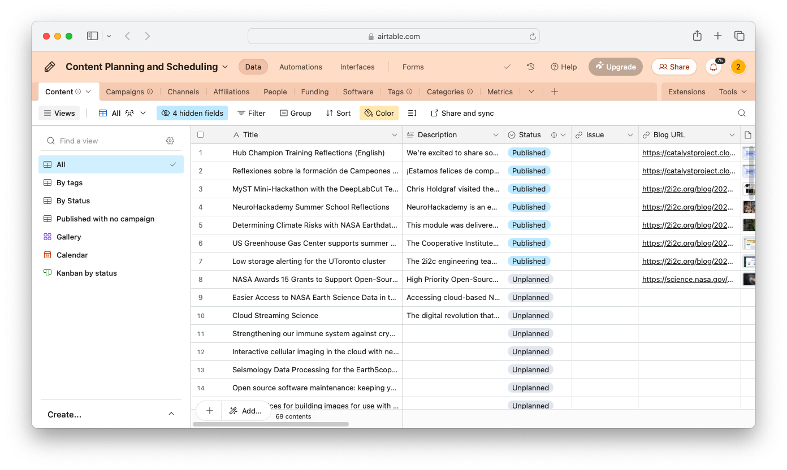

# Contribute to the blog

[The blog at 2i2c.org/blog](https://2i2c.org/blog) is the primary way that we communicate our work to the external world.

## Why do we blog?

Blogging serves a few key purposes:

- **Provide transparency**. It is a way for us to show others what we've been up to and where we are going next.
- **Communicate our impact**. It is a way to share how our work has impacted communities we serve either in domain areas or in open source.
- **Invite feedback**. It is a way to create content we can reference to others to facilitate conversations and ask questions.

## Where is the blog hosted?

Our blog is a subset of our [website repository for 2i2c.org](https://github.com/2i2c-org/2i2c-org.github.io).

It exists at the [`/blog` subdirectory](https://github.com/2i2c-org/2i2c-org.github.io/tree/main/content/blog). Each page is a folder in that directory, with the folder name being the URL for the blog entry, and `index.md` having the blog's content.
For example, the post at https://2i2c.org/blog/2025/jupyter-book-cors/ exists in a markdown file at [`/content/blog/2025/jupyter-book-cors/index.md](https://github.com/2i2c-org/2i2c-org.github.io/blob/main/content/blog/2025/jupyter-book-cors/index.md).


## Principles to follow

- **Blog regularly and often**. The most important thing is that we are in a habit of regularly communicating our work.
- **Keep it short**. Blog posts should be quick and easily digestible. Ideally around 300-500 words.
- **Keep it simple**. Don't use this to make complex arguments or long reports. Blogs should be bite-sized and to-the-point.
- **Make it "safe to try" over perfect**. Don't get bogged down in writing the perfect post. Just get something up there and move on.

## A simple blog post template for new development

Here's a simple structure for blog posts that describes new functionality we've created.
It is a tried-and-true method for quickly communicating impact. You can copy/paste this into a markdown file and edit the headers as you wish.

```markdown
---
title: "Enabling <outcome> with <development we've done>"
date: <date of post>
---

The following could be section headers (e.g. `##`) or just sentences in a short paragraph.

1. What's a problem?
2. What's the cost of not solving it?
3. What has changed that makes it solveable?
4. What did we do to solve it?
5. What does this unlock?
```

## How do add a category and tags

Each post has one category and multiple tags. Categories describe the post's intent, and tags cover its main themes or topics. You add them to the frontmatter of posts like so:

```markdown
---
title: Post title
date: "2025-01-01"
category: updates
tags:
  - open source
  - geoscience
---
```

### How to format categories and tags

We use **lowercase formatting** as well as **spaces instead of hyphens** for both tags and categories. For example, `open source`, not `open-source` and not `Open Source`.

### Common categories

We try to keep the number of categories small, and non-overlapping in their meaning. [Here's a list of all our categories](https://2i2c.org/categories/), but we try to keep it only to the ones below:

- `impact` - telling stories of impact that 2i2c has had, either via contributors to a domain / open source community, or via communities we've enabled with our service.
- `service` - updates about our service and work we've recently done for it.
- `organization` - updates about our organization that isn't directly related to our service

### Common tags

We have a lot of tags, so don't worry about creatin a new one if you don't think your tag has been covered yet. [Here's a list of all our tags](https://2i2c.org/tags/).

## How to write a new blog post

The simplest way to write a new blog post is to do the following:

- Copy/paste the folder for a previous blog post.
- Rename the folder to be the URL slug of the new post you're writing
- Update the `index.md` file's metadata to reflect your new post. Optionally add a tag and a category.
    - The only required metadata fields to change are:`title`, `authors`, `date`.
    - Posts can have multiple tags (to denote general ideas that are reflected in the post), and a single category (to reflect major types of posts). Don't worry too much about this.
- Update the content of the blog post to reflect your new content. You don't need to define a top-level title if you're using the `title:` key in the page metadata.
- If your post requires images, put them in a sub-folder within the post's folder called `images/` and refer to them with relative links from the post.

### How to add a featured image

You can optionally add a featured image, but don't worry about this unless you really want to. T do so, put an image in the same folder as the blog post that starts with `featured`.

For example, if your blog post lives at `content/blog/2024/mypost/index.md`, then you could put the featured image at `content/blog/2024/mypost/featured.png`.

### How to preview your blog post

_Note: you don't actually need to preview the post if it's too much hassle. Just make a PR and the GitHub PR preview can be used to see what it looks like._

To preview your post locally:

- Make sure you've saved the post to disk.
- Ensure that the **date** of the post is before today's date, otherwise the post won't show up (if the post will go up in the future, just temporarily make the date earlier to ensure it shows up)
- [Install Hugo](https://gohugo.io/installation/)
- Run `hugo serve -D` from the repository root

This will run a server that can be used to inspect your post.

### How to do all of this via GitHub in the browser without doing anything locally

The easiest way to do all of the above _without ever leaving the browser_ is to do the following:

1. Go to https://github.dev/2i2c-org/2i2c-org.github.io/ this will open a VSCode instance in-browser with the repository loaded up.
    1. Alternatively you can do this from the GitHub UI by going to a repository and pressing `.`
2. Create a new branch that will track your changes by clicking the buttons below and typing in a new branch name: 
    
    
3. Follow the steps above (you won't be able to preview, don't worry about that).
4. When you're ready to propose a new change, click the "changes" tab, and then the "commit and push" button. 

    
5. Follow the prompts to create a new pull request from within VSCode, or navigate to https://github.com/2i2c-org/2i2c-org.github.io/ and open the PR from there

(blog:topics)=
## What to post on the blog

Generally speaking, we can post as often as we wish.
Our blog should be a running heartbeat of our organization, and it is OK if the information on there isn't perfect.
Be creative and experiment with formats that you think might be interesting or fun.
If there's something particularly important, we can signal-boost it with our [Mailing list](mailinglist.md).

Here are a few ideas for blog post topics for inspiration:

- **2i2c organizational updates**. Provide updates about important organizational decisions and changes. For example:
  - Major changes to strategy
  - Governance or other organizational changes
  - New hires
- **Major project updates**. For major projects and collaborations, we should provide regular updates about the work that we've done. This shouldn't frame 2i2c as the sole producer for these projects (unless we really are the sole producer), but demonstrate how 2i2c has contributed to the overall effort. For example:
  - Major deliverables that we’ve met on a project
  - New collaborations
- **Open source updates**. If we do particular service work, or make a strong technical improvement in an open source project, we should tell the world about it.
- **Updates from the Managed JupyterHub Serivce**. As hub service infrastructure grows and evolves, and as we serve more communities with it, we should tell others about the impact we are having.
- **Topic dives**. There may be particular topics that we want to write about, like open culture, cloud optimization, etc. These will help us crystallize our thoughts, demonstrate expertise, and share knowledge with others.

## How to optimize images

Optimizing images saves space in our repository and in traffic load times.
The [`oxipng` tool](https://github.com/shssoichiro/oxipng) is one that we've used here.
These are brief instructions to get it working based [on the `oxipng` instructions](https://github.com/shssoichiro/oxipng#installing).

It is written in Rust, so you'll need to install `cargo`, install `oxipng`, and then run it.
**To Install Cargo**, follow [the Cargo installation steps](https://doc.rust-lang.org/cargo/getting-started/installation.html).

This will install both Rust and Cargo.

On Windows and Mac, it should be something like:

```
curl https://sh.rustup.rs -sSf | sh
```

One you have done this, you can either run `oxipng` manually or via `pre-commit`.
Both are described below.

### Run `oxipng` with pre-commit

If you have pre-commit installed in this repository, it will run `oxipng` on any `.png` files that have been added automatically.

Simply `cd` into this repository root, then run:

```
$ pip install pre-commit
$ pre-commit install
```

Now when you commit a `.png` file, `oxipng` will be run.

### Run `oxipng` manually

To run `oxipng` manually, follow these steps:

1. **Install `oxipng`**. Use `cargo` to install `oxipng`.

   ```
   cargo install oxipng
   ```
2. **Run the optimization on our images**.
   This one uses several sensible options and will optimize any image in the repository.

   ```
   oxipng -o 4 -i 1 --strip safe --recursive content *.png
   ```

Once the images are optimized, re-commit them to the repository and push the changes.

## Schedule a blog post with AirTable

We use AirTable for systematically planning content and scheduling blog posts. The workflow is as follows:

1. A member of 2i2c has an idea for content and fills out an AirTable form to schedule a blog post.
1. The communications team reviews the form, then prioritizes and coordinates the work required for publication.
1. The communications team publishes the blog post, and shares it with the community via social media channels where appropriate (see [Social Media](social.md)).

:::{warning}
Do not include sensitive information in the AirTable. Information will become public on our open-source, website GitHub repository when scheduling content.
:::

(blog:airtable-form)=
### AirTable Form

Use the form linked below to schedule new content pieces for [2i2c.org/blog](https://2i2c.org/blog). There is also the option to schedule a social media campaign along with the blog post – see [Social Media](social:scheduling) for more details on this workflow.

:::{button-link} https://airtable.com/appM2L2x1uglMU0hy/pagy7CvM0msgqRCcA/form 
:color: primary
Submit Your Content
:::

### Scheduling blog posts

Information collected from the [AirTable form](blog:airtable-form) is stored in the *Content* table of the [Content Planning and Scheduling](https://airtable.com/appM2L2x1uglMU0hy?ao=cmVjZW50) AirTable base that is used to prioritize content for publication, and coordinate the work for publication using [GitHub issues](https://github.com/2i2c-org/2i2c-org.github.io/issues) in our website repository.



The *Content* table contains the following important fields the the communications team needs to pay attention to:

- Publish Date
- Status
- Social media campaign?

#### Publish Date

A blog post may not initially have a publish date set. The communications team is responsible for using their judgment for scheduling posts based on perceived priority and determining availability of authors where required.

#### Status

There are 4 possible states: {bdg-secondary}`Unplanned` (default), {bdg-primary}`Scheduled`, {bdg-success}`Published` and {bdg-danger}`Cancelled`.

When a blog post is ready to be authored, it should be marked as {bdg-primary}`Scheduled`. This triggers an AirTable automation that opens a [GitHub issue](https://github.com/2i2c-org/2i2c-org.github.io/issues) in our website repository to track work (see [example issue](https://github.com/2i2c-org/2i2c-org.github.io/issues/318)). Once the work is completed, the communications team can mark the item as {bdg-success}`Published`.

:::{figure} images/blog-automated-issue.png
:alt: Automated GitHub issue
An example of an automated GitHub issue triggered from setting the {bdg-primary}`Scheduled` status.
:::

#### Social Media Campaign?

The form includes an option to schedule a social media campaign to promote the blog post. This may initially be left unchecked. If the box is checked and the *Social media campaign date* is specified, then this triggers an AirTable automation to populate the *Campaigns* table. See [Scheduling social media campaigns](social:scheduling) for more information.

#### Other fields

The AirTable form is designed to be as low-touch as possible so that the submitter does not need to fill out a lot of information. However, there are some other fields in the *Content* table, such as *Tags*, *Categories*, *People*, *Affiliations* and *Open Source Software*, that the Communications team may want to populate on their behalf based on information provided in the mandatory *Notes* field.
