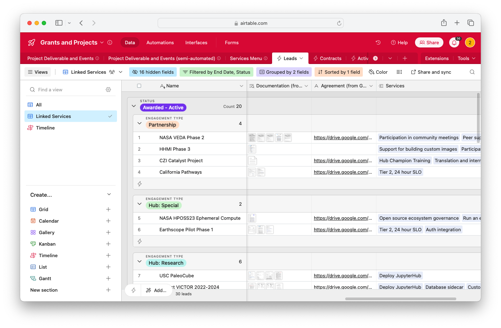
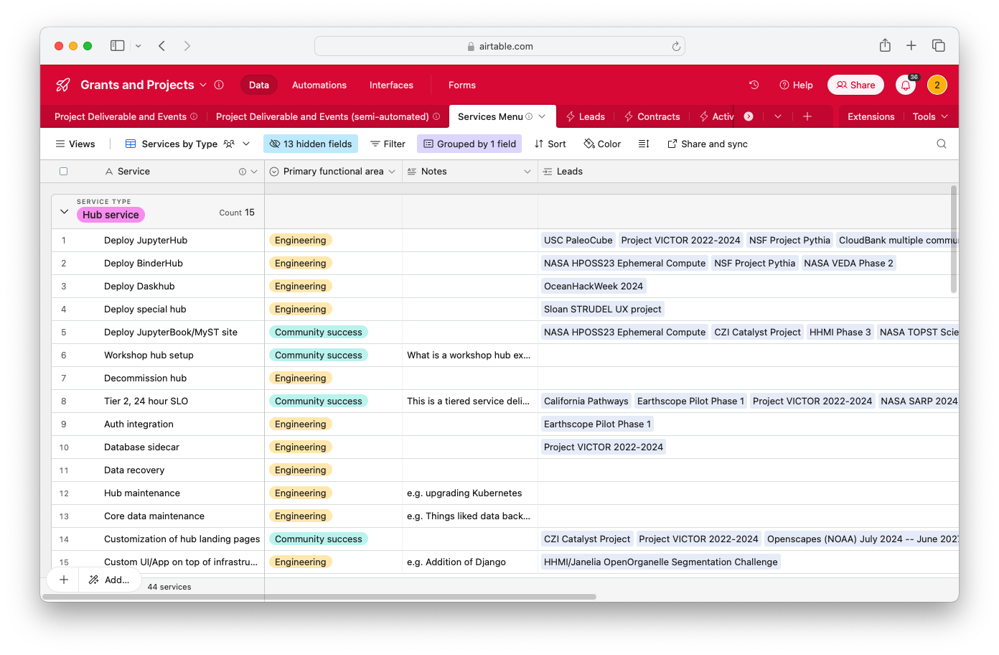
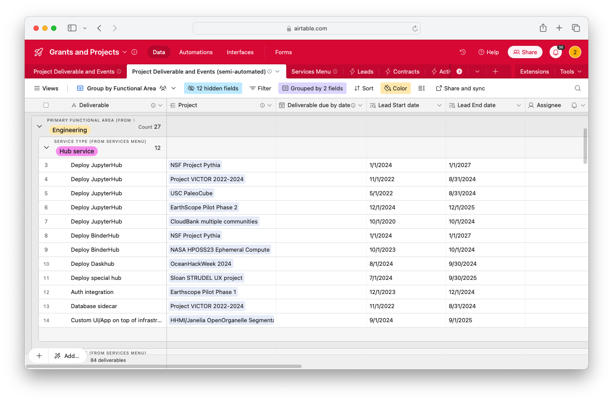

# Grants and projects workflow

Grants and projects are partnerships that are more complex and bespoke than our [hub service contracts](./hub-service.md).
They often require more work to achieve, as well as more work to deliver.

In the remainder of this document we use _grant_ to refer to **both** traditional grants and projects workflows, as well as more complex contracts that are nonetheless service contracts (also known as _Partnership, Hub: Special_ and _Development_ engagement types in the [Leads AirTable](https://airtable.com/appbjBTRIbgRiElkr/tblmRU6U53i8o7z2I/viwQoT7EO2K97mMEu?blocks=hide)).

## Sources of truth

We split our workflow around a few Sources of Truth:

1. **[Our `Leads` AirTable](https://airtable.com/appbjBTRIbgRiElkr/tblmRU6U53i8o7z2I/viwQoT7EO2K97mMEu?blocks=hide) captures metadata about each grant**.
   Each entry has a mirrored GitHub issue in the `leads/` repository with an auto-generated table that shares its metadata on GitHub.
2. **[Mirrored issues in the `leads/` repository](https://github.com/2i2c-org/leads) capture our conversation around a grant lead**, such as coordinating the actions we must take to complete its application.
3. **Extra GitHub issues capture specific deliverables and tasks**, such as completing a grant application. These should be linked from the mirrored issue described above.
4. **[Our `Grants and Projects` AirTable base](https://airtable.com/apptR4AXWIFNGkZMz/tbl5Iy8jUfxvhKziq/viwCCbohYnor8ssWV?blocks=hide) tracks deliverables for grants and projects we've been awarded**.
   This is where we collect deliverables information, such as deadlines for specific project deliverables, to help prioritization and capacity planning for cross-functional areas.

:::{figure} ./images/grants-airtable.png
Here's an example of the AirTable entry for a grant lead (left) and its corresponding mirrored GitHub issue (right) where we coordinate conversation.
:::

## Workflow around grant and project leads

1. **Add a new entry to [the `Grants and projects` view](https://airtable.com/appbjBTRIbgRiElkr/tblmRU6U53i8o7z2I/viwQoT7EO2K97mMEu?blocks=hide)**. This will automatically create a GitHub issue in [the `leads/` repository](https://github.com/2i2c-org/leads).
2. **Fill in as much metadata as you can**.
   Fill in the fields for each column of the new entry.
   This gives our team the context we need to reason about the opportunity.

   As we fill in this information, it will automatically be mirrored to the GitHub issue for the grant.
3. **Discuss and coordinate in the mirrored GitHub issue**. 
   Use the GitHub issue to have discussion across the team about the status of the grant.
4. **Create new GitHub issues to coordinate work**.
   If we must coordinate a plan around completing a grant, create a new GitHub issue and link it somewhere in the comments from the mirrored issue.
   % TODO: Consider adding a field in our AirTable for a "work issue" if the need arises.
5. **When a grant is awarded, add an entry to [our active `Grants and projects` AirTable](https://airtable.com/appbjBTRIbgRiElkr/tblCUDimpwHgiWbPq/viwzqESsgIqWZoVZf?blocks=hide) and link it to the Lead**.
   We use the [active `Grants and projects` airtable](https://airtable.com/appbjBTRIbgRiElkr/tblCUDimpwHgiWbPq/viwzqESsgIqWZoVZf?blocks=hide) to track grants that we have been awarded.
   Once a grant is awarded, link the Lead to it start tracking our work over there.

## Workflow for grant and project deliverables

### The Grants and Projects base

We use the [Grants and Projects base](https://airtable.com/apptR4AXWIFNGkZMz/tbl5Iy8jUfxvhKziq/viwCCbohYnor8ssWV?blocks=hide) to separate  deliverables data from financial/leads/fundraising data contained in the main 2i2c base. This avoids accidentally changing important accounting records and better compartmentalisation of activities as operations scale.

### Leads as a unique project identifier

We use records from the Leads table as a unique identifier for each project in the Grants and Projects base. This allows us to make use of the lead metadata, such as the `Awarded – Active` status and `Hub:Special/Partnership/Development` engagement types.

### Tables

(grants-and-projects:leads)=
#### Leads table synced from the 2i2c base

We use this table to uniquely identify every grant and project and link them to project deliverables. Every grant and project that is _Active – Awarded_ or _Needs Admin_  is displayed as a row on this table with a collection of deliverables associated with each one.

To add a deliverable to a grant or project:

1. Go to the Leads table and choose the [**Linked Services** view](https://airtable.com/apptR4AXWIFNGkZMz/tblLWmZGM6SRc1zxz/viwd9cO872M1yB19K?blocks=hide)
2. Go to the _Services_ column and choose the project deliverables required from the list that is pulled in from the [Services Menu](https://airtable.com/apptR4AXWIFNGkZMz/tbl5Iy8jUfxvhKziq/viwCCbohYnor8ssWV?blocks=hide) table

:::{note}
If an option you require does not exist, then please contact the {role}`Delivery Manager` to update the Services Menu table.
:::

*This ensures have a source of truth for the major deliverables associated with any contract*

##### Area of responsibility

- [ ] {role}`Partnerships Lead` or Partnerships team

#### Services menu

This table contains a list of standard services that are rendered by engineering and/or partnerships. For any grant or project deliverable that is not part of our standard services, this should be routed through the [Product Delivery Flow](../../product/deliveryflow.md).

Every deliverable that is [added to a grant or project](grants-and-projects:leads) in the Leads table (see above) is displayed as a row on this table with a collection of leads associated with each one. As noted above, services that do not exist yet can be updated here. **Take care not to introduce similar entries to minimize complexity**, e.g. "run a training workshop" can be represented by the broader "run an event" deliverable, and **consider whether the new item needs to go through the [Product Delivery Flow](../../product/deliveryflow.md).**

*This ensures we have a reliable way to answer "which contracts will deliverable X feed into?"*

##### Area of responsibility

- [ ] {role}`Chief of Staff`

#### Project deliverables

This table contains a unique row for **each deliverable per project**. The table is populated using an AirTable automation to expand the collection of deliverables associated with each grant and project in the Leads table each time a record is updated.

There are 5 broad Service Types that each deliverable is categorized under. These are:

1. Hub service - standard services that can be provided "out-of-the-box".
1. Software Development - engineering services that are non-standard and do not feed into the Product Delivery Flow, e.g. feature development in collaboration with an external partner.
1. Technical guidance - the generally includes support for using hub services that can be handled by the community success team on the frontline and may be escalated to engineering where needed.
1. Community guidance/consultancy - community success services that are usually written into grants and projects and implicit work that is done to support community partners, e.g. participation in community meetings.
1. Training and events - any services related to time-sensitive support for an event or training delivery.

This data is useful for assigning deadlines and capacity planning. This gives a

*A reliable way to answer "what deliverables _must_ we complete by date Y because of contracts?"*

and

*A reliable way to answer "what team capacity will be consumed by deliverables we cannot deprioritize due to their link to contracts?"*

##### Area of responsibility

- [ ] {role}`Chief of Staff` and {role}`Engineering Manager` with support from the Partnerships team to ascertain deadlines.
